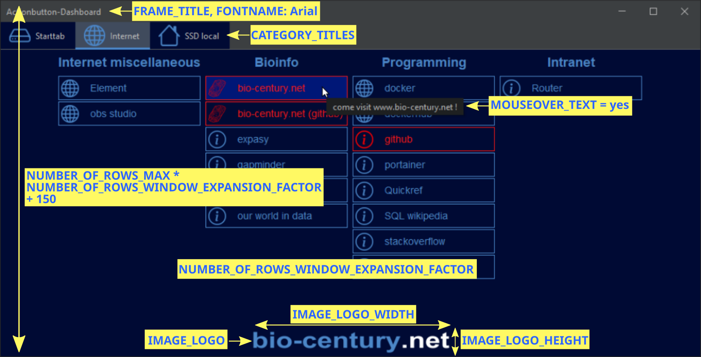

# The Actionbutton-Dashboard Project

# Abstract
Sick and tired of endlessly navigating through directories and bookmark inventories as part of your everyday-workflow? The 
Actionbutton-Dashboard-project enables you to set up an easy-to-configure array of JButtons, which can open local apps, folders, 
network drives 
as well as intranet and internet websites. The array is depicted as a graphical interface:
<br>
<br>
All buttons can be customized to your needs by using simple spreadsheet-based configuration tables. 
After you are done with defining button names, paths and colors, just double-click on the jar file (fat-jar) and the JButton-window will open up. <br>
<br>
An optional field for logos gives you some space to place a company logo in order to give the panel a professional touch. <br><br>
NOTE: Everything can be setup quite easily, you don't need to have programming skills at all to get some beautiful results. Just check 
out the step-by-step manual in the [Getting Started](#gettingstarted) section!

# Table of Content
- [Getting Started](#gettingstarted)
  - [Manual For USERS](#ManualForUSERS)
  - [Manual For Programmers](#ManualForProgrammers)
  - [Inspirations & ToDo's](#InspirationsandToDos)
- [Folder structure](#folderstructure)
- [Configuration File (config.properties)](#ConfigFile)
- [Spreadsheet Files](#SpreadSheet)
- [Requirements](#Requirements)
- [License](#license)
- [Contributors & Acknowledgments](#Contributors&Acknowledgments)
- [Sources](#Sources)
- [Contact](#contact)

## <a id='gettingstarted'></a> Getting Started
This section is subdivided into a [Manual For USERS](#ManualForUSERS) and a [Manual For PROGRAMMERS](#ManualForProgrammers).

### <a id='ManualForUSERS'></a> Manual For USERS
This is a step-by-step manual for users. Everything you need to set up your Actionbutton-Dashboard can be found in the target 
folder. Please check out section [Folder structure](#folderstructure) as reference for the following instructions:
- Copy the target folder ([Folder structure](#folderstructure): 1) into a local destination folder of your choice.
- Run the jar file named ```Actionbutton-Dashboard-jar-with-dependencies.jar``` ([Folder structure](#folderstructure): 2) placed in the root folder 
  as a first test. If this 
  doesn't work, check out if a Java Software Development Kit (SDK) is installed on your computer. Manuals can be found everywhere, e.g. on         
  <a href="https://www.geeksforgeeks.org/download-and-install-java-development-kit-jdk-on-windows-mac-and-linux/">www.geeksforgeeks.org</a>.
- Set up the configuration file ```config.properties``` ([Folder structure](#folderstructure): 3 and section [ConfigFile](#ConfigFile)) to define 
  titles, colors, icons and logos.
- Complement the ```icons-``` and the ```images-```folder ([Folder structure](#folderstructure): 4 & 5) with your individual layout figures used for 
  the tabs (-> see ```config.properties```) and the JButtons (-> see [Folder structure](#folderstructure): 6, spreadsheet files, tab "icons").
- Configure the spreadsheet files used for your dashboard ([Folder structure](#folderstructure): 6 and [Spreadsheet](#spreadsheet)). 
  There are 5 sheets available in each workbook. IMPORTANT: CLOSER ALL WORKBOOKS AFTER SAVING BEFORE EXECUTING THE JAR-FILE AGAIN
- Re-run by double-clicking on the ```Actionbutton-Dashboard-jar-with-dependencies.jar```-file in the root folder. 

<br>
https://raw.githubusercontent.com/bio-century/Actionbutton-Dashboard/main/video_tutorial/github_demo_video.mp4

<br>
NOTE: If errors occure leading to the jar-file not being executed, review the template delivered by downloading the repo, which also serves as an 
example right away. Please pay attention to the proper setting of spaces in the config-file. Moreover, the following procedure might give you 
extra hints:
- Open a shell in the jar-file directory (e.g. for Windows: cmd).
- Type ```java -jar Actionbutton-Dashboard-jar-with-dependencies.jar```.

### <a id='ManualForProgrammers'></a> Manual For PROGRAMMERS
First of all: Your contributions, ideas and feedback are very welcome. Also please be patient if merge requests are pending due to a limited 
amount of time. This work is structured due to my (yet rudimentary) knowledge of Java practises:
- (i)   : The pom.xml file generated with the help of Maven, which defines dependencies, importing packages and copy the resources into the target 
  folder.
- (ii)  : The Main.java where the ```config.properties```-parameters are imported and the dashboard is built.
- (iii) : Class used in main to build the dashboard for each tab.
- (iv)  : Classes used for scaling and converting icons and logos for the panel and the JButtons.
- (v)   : Class to set up the action events (listener) for each JButton.
- (vi)  : Classes reads in spreadsheet data and determines column and row numbers.
- (vii) : Plain-text file to configuration titles, colors, icons and logos.
- (viii): Place to put all icon-files (e.g. as .png) used for the individual JButtons. Don't forget to reference them in the ```config.
  properties```- or the icon-tab of the corresponding spreadsheet-workbook accordingly.
- (ix)  : Place to put your identity or company logo. Don't forget to reference them in the ```config.properties```-file
- (x)   : Spreadsheet files used to define JButton names, paths, colors, icons and positions within the array. Please use the given template for 
  formatting support. <br>

NOTE: The fatjar-file of the target folder was generated by running the Maven-command ```mvn clean package```.

### <a id='InspirationsandToDos'></a> Inspirations & ToDo's
To all you software developer out there, this is a section where ideas can be placed :). Please keep in mind, that the general 
focus of this project is to have an Actionbutton-Dashboard with maximum accessibility, so that it can be configured by 
anyone in an easy manner...Thanks for your inspirations!
- [ ] Wrap config-file parameters of the main into structures, perhaps by writing a load-method
- [ ] Eliminate the ```Cleaning up unclosed ZipFile for archive```-Warning
- [ ] Add a custom-icon-option for the jar-starter to the fat-jar
- [ ] Add modifyable-tabcolors-option
- [ ] Next Idea 1
- [ ] Next Idea 2
- [ ] ...

## <a id='folderstructure'></a> Folder structure
```
|   LICENSE
|   pom.xml                                                     <--- (i)                : Maven-based pom.xml-file to define dependencies and copy 
|                                                                                         the resources into the target folder
|   README.md
|
+---.idea +++                                                   (COLLAPSED)
+---META-INF +++                                                (COLLAPSED)
+---README_Images +++                                           (COLLAPSED)
|
+---src
|   |
|   \---main
|       +---java
|       |   |   Main.java                                       <--- (ii) Main 
|       |   |
|       |   +---packageBuildDashboard +++                       <--- (iii), (COLLAPSED) : used in main to build the dashboard for each tab
|       |   |
|       |   +---packageIconEditing +++                          <--- (iv), (COLLAPSED)  : scales and converts icons and logos used for the panel and
|       |   |                                                                             the JButtons 
|       |   |
|       |   +---packageJButtons +++                             <--- (v), (COLLAPSED)   : sets up the action events (listener) for each JButton   
|       |   |
|       |   \---packageSpreadsheet +++                          <--- (vi), (COLLAPSED)  : reads in spreadsheet data and determines column and row 
|       |                                                                                 numbers
|       |
|       \---resources
|           |   config.properties                               <--- (vii)              : Configuration file defining titles, colors, icons and logos
|           |
|           +---icons +++                                       <--- (viii), (COLLAPSED): icons used for the individual JButtons
|           +---images +++                                      <--- (ix), (COLLAPSED)  : image used to place your identity or company logo
|           |
|           \---spreadsheetFiles                                <--- (x)                : spreadsheet files used to define JButton names, 
|                   Internet.xlsx                                                         paths, colors, icons and positions within the array
|                   SSD local.xlsx
|                   Starttab.xlsx
|
\---target                                                      <--- (1) Target path to be copied to your the local folder of your choice
    |   Actionbutton-Dashboard-jar-with-dependencies.jar        <--- (2) Executable JAR, will be updated when modifying the Spreadsheet
    |   Actionbutton-Dashboard.jar
    |
    +---classes +++                                             (COLLAPSED)
    +---generated-sources +++                                   (COLLAPSED)
    +---maven-archiver +++                                      (COLLAPSED)
    +---maven-status +++                                        (COLLAPSED)
    \---src
        |   config.properties                                   <--- (3)                : Configuration file defining titles, colors, icons and logos
        |
        \---main
            +---java +++                                        (COLLAPSED)
            |
            \---resources
                +---icons +++                                   <--- (4), (COLLAPSED)   : icons used for the individual JButtons
                +---images ++++                                 <--- (5), (COLLAPSED)   : image used to place your identity or company logo
                |
                \---spreadsheetFiles                            <--- (6)                : spreadsheet-workbooks used to define JButton names, 
                        Internet.xlsx                                                     paths, colors, icons and positions within the array
                        SSD local.xlsx
                        Starttab.xlsx
```
[//]: # (tree /a /f)

## <a id='ConfigFile'></a> Configuration File (config.properties)
| tab                                       | explanation                                                | input values                                |
|-------------------------------------------|------------------------------------------------------------|---------------------------------------------|
| USER_DIR_JAVA                             | dir of main file                                           | single string                               |
| USER_DIR_SPREADSHEETS                     | dir of spreadsheet-workbooks                               | single string                               |
| USER_DIR_ICONS                            | dir of icons for tabs and buttons                          | single string                               |
| USER_DIR_IMAGES                           | dir of company logo                                        | single string                               |
| FRAME_TITLE                               | title of the dashboard window                              | single string                               |
| CATEGORY_TITLES                           | titles (in order) of the categories                        | string array separated by <space>,          |
| MOUSEOVER_TEXT                            | explanatory text showing up on mouse-over                  | (longer) text as string                     |
| SPREADSHEET_NAMES                         | file names (in order) of all spreadsheet files             | string array separated by <space>,          |
| FONTNAME                                  | font name for all labels used (example: Arial)             | single string                               |
| NUMBER_OF_ROWS_WINDOW_EXPANSION_FACTOR    | scales the window height with respect to amount of rows    | number                                      |
| NUMBER_OF_COLUMNS_WINDOW_EXPANSION_FACTOR | scales the window height with respect to amount of columns | number                                      |
| MY_COLOR_*                                | multiple colors defining tab background colors etc.        | 3 integers from 0-255 separated by <space>, |
| TAB_ICON_NAME                             | file names (in order) of the icons used for the tabs panel | string array separated by <space>,          |
| IMAGE_LOGO                                | file name of company logo                                  | single string                               |
| IMAGE_LOGO_WIDTH                          | company logo dimensions: width                             | single string                               |
| IMAGE_LOGO_HEIGHT                         | company logo dimensions: height                            | single string                               |


## <a id='SpreadSheet'></a> Spreadsheet Files
| tab        | explanation                                                                        | input values                                   |
|------------|------------------------------------------------------------------------------------|------------------------------------------------|
| fieldnames | Strings that are imprinted onto the button                                         | String (limited space)                         |
| URL        | link, that the button is going to open. It can be a file path, a file or a website | URLs and local paths as Strings                |
| color      | RGB-code that defines the individual color of each button (text and button frame)  | Three Numbers from 0-255 seperated by ,        |
| comments   | text that shows up on mouse-over the JButton. If empty, the field will be ignored  | Strings with extended space                    |
| icons      | filename of icon-image for each JButton. If empty, the field will be ignored       | Filenames of Images stored in the icons-folder |


## <a id='Requirements'></a> Requirements
```
java 19.0.1 2022-10-18
Java(TM) SE Runtime Environment (build 19.0.1+10-21)
Java HotSpot(TM) 64-Bit Server VM (build 19.0.1+10-21, mixed mode, sharing)

Apache Maven 3.9.1
Default locale: en_US, platform encoding: UTF-8
```
## <a id='license'></a> License
This work is published under the GPL-2.0 license.


## <a id='ContributorsAcknowledgments'></a> Contributors & Acknowledgments
Many thanks to the comber.io admin for inspirations, code reviews and for initializing the bio-century.net website.


## <a id='Sources'></a> Sources
https://stackoverflow.com/questions/4871051/how-to-get-the-current-working-directory-in-java <br> 
https://stackoverflow.com/questions/13438871/log4j2-configuring <br>
https://mkyong.com/java/apache-poi-reading-and-writing-excel-file-in-java/ <br>
https://mvnrepository.com/artifact/org.apache.poi/poi-ooxml/3.9 <br>
https://www.javatpoint.com/how-to-read-excel-file-in-java <br>
https://stackoverflow.com/questions/2194284/how-to-get-the-last-column-index-reading-excel-file <br>
https://poi.apache.org/apidocs/dev/org/apache/poi/hssf/usermodel/HSSFRow.html#getLastCellNum-- <br> <br>

https://www.youtube.com/watch?v=816wduoH9eY <br>
https://coderanch.com/t/657887/java/Pausing-loop-wait-response-actionListener <br>
https://docs.oracle.com/javase/tutorial/uiswing/layout/gridbag.html <br>
https://docs.oracle.com/javase/tutorial/uiswing/layout/visual.html <br>
https://stackoverflow.com/questions/57075145/what-element-controls-the-color-of-the-thin-strip-between-jpanel-and-jtabbedpane <br>
https://stackoverflow.com/questions/15694107/how-to-layout-multiple-panels-on-a-jframe-java <br> <br>

https://stackoverflow.com/questions/2194284/how-to-get-the-last-column-index-reading-excel-file <br>
https://poi.apache.org/apidocs/dev/org/apache/poi/hssf/usermodel/HSSFRow.html#getLastCellNum-- <br>
https://www.youtube.com/watch?v=816wduoH9eY <br>
https://coderanch.com/t/657887/java/Pausing-loop-wait-response-actionListener <br> <br>

https://www.youtube.com/watch?v=mS0GOFx7KEQ <br> (How to Read Excel File in Java by Programming Guru) <br>
https://getbootstrap.com/ <br>


## <a id='contact'></a> Contact
info@bio-century.net