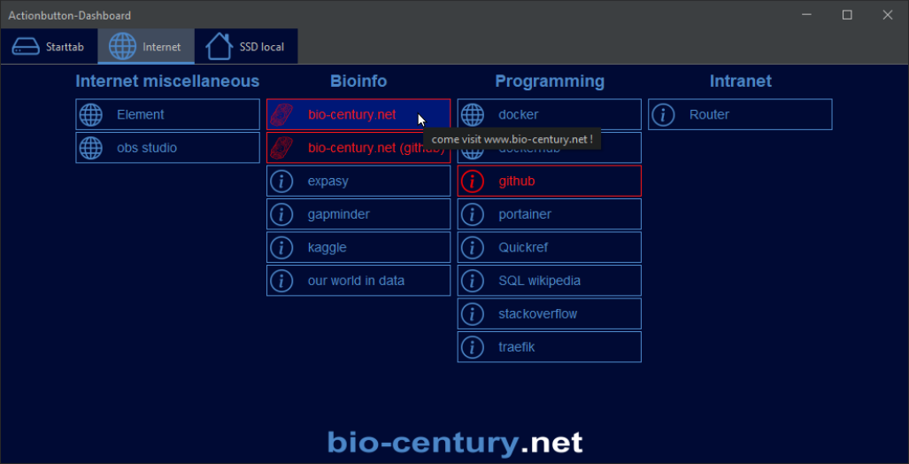

# The Actionbutton-Dashboard Project

# Abstract
Sick and tired of endless navigation through directories and bookmark inventories? The Actionbutton-Dashboard-project
sets up a configurable array of JButtons which can open local apps, folders and websites. <br>
 <br>
All buttons can be defined individually according to your needs by using simple spreadsheet configuration tables. 
After you are done with defining button names, paths and colors, just double-click on the jar file (fatjar) and the JButton-window will open. <br>
 <br>
An optional field for logos will give companies the opportunity to introduce their corporate identity design.

# Table of Content
- [Import](#import)
- [Getting Started](#gettingstarted)
- [Folder structure](#folderstructure)
- [Example](#example)
- [Planned Updates](#PlannedUpdates)
- [Contributors & Credits](#Contributors&Credits)
- [License](#license)
- [Contributors & Acknowledgments](#Contributors&Acknowledgments)
- [Sources](#Sources)
- [Contact](#contact)


## <a id='import'></a> Import

## <a id='gettingstarted'></a> Getting Started
For those of you who just want to use the dashboard after some minor adjustments please draw your attention to (1) 
the BUTTON_AUTOSTART.xlsx-spreadsheet file () and (2) the Actionbutton-Dashboard-jar-with-dependencies.jar. First, 
please open and modify the spreadsheet as follows:

| tab          | explanation                                                                        |
|--------------|------------------------------------------------------------------------------------|
| fieldnames   | words that are imprinted onto the button                                           |
| category     |                                                                                    |
| URL          | link, that the button is going to open. It can be a file path, a file or a website |
| color        | color in RGB-code that defines the color of the button (text and button frame)     |

Note: The buttons have to be defined from top to bottom. Blank calls will cause, that everything below will be ignored 

When you are done, please save the spreadsheet and double-click on the jar

```java -jar my-project-name-jar-with-dependencies.jar```


## <a id='folderstructure'></a> Folder structure
```
|   LICENSE
|   pom.xml
|   README.md
|
+---.idea +++                                                    (COLLAPSED)
+---META-INF +++                                                 (COLLAPSED)
+---README_Images +++                                            (COLLAPSED)
|
+---src
|   |
|   \---main
|       +---java
|       |   |   packageBuildDashboard.BuildDashboard.java
|       |   |   Main.java                                        <--- (4) Main 
|       |   |
|       |   +---packageIconEditing +++                           (COLLAPSED)
|       |   +---packageJButtons +++                              (COLLAPSED)
|       |   \---packageSpreadsheet +++                           (COLLAPSED)
|       |
|       \---resources                                            <--- (3) Configuration file defining paths amd spreadsheet sizes
|           |   config.properties
|           +---icons +++                                        (COLLAPSED)
|           +---images +++                                       (COLLAPSED)
|           |
|           \---spreadsheetFiles
|                   BUTTON_AUTOSTAR2.xlsx
|                   BUTTON_AUTOSTAR3.xlsx
|                   BUTTON_AUTOSTART.xlsx
|
\---target
    |   Actionbutton-Dashboard-jar-with-dependencies.jar         <--- (2) Executable JAR, will be updated when modifying the Spreadsheet
    |   Actionbutton-Dashboard.jar
    |
    +---classes +++                                              (COLLAPSED)
    +---generated-sources +++                                    (COLLAPSED)
    +---maven-archiver +++                                       (COLLAPSED)
    +---maven-status +++                                         (COLLAPSED)
    \---src
        |   config.properties
        |
        \---main
            +---java +++                                         (COLLAPSED)
            |
            \---resources
                +---icons +++                                    (COLLAPSED)
                +---images +++                                   (COLLAPSED)
                |
                \---spreadsheetFiles
                        BUTTON_AUTOSTART.xlsx                     <--- (1) Spreadsheet to be modified

    
    
```
[//]: # (tree /a /f)

## <a id='example'></a> Example
## <a id='PlannedUpdates'></a> Planned Updates
## <a id='contributors&credits'></a> Contributors & Credits
## <a id='license'></a> License
This work is published under the GPL-2.0 license.

## <a id='ContributorsAcknowledgments'></a> Contributors & Acknowledgments
Many thanks to the comber.io admin for inspirations, code reviews and for initializing the bio-century.net website.

## <a id='Sources'></a> Sources

- https://stackoverflow.com/questions/4871051/how-to-get-the-current-working-directory-in-java 
- https://stackoverflow.com/questions/13438871/log4j2-configuring
- https://mkyong.com/java/apache-poi-reading-and-writing-excel-file-in-java/
- https://mvnrepository.com/artifact/org.apache.poi/poi-ooxml/3.9
- https://www.javatpoint.com/how-to-read-excel-file-in-java
- https://stackoverflow.com/questions/2194284/how-to-get-the-last-column-index-reading-excel-file
- https://poi.apache.org/apidocs/dev/org/apache/poi/hssf/usermodel/HSSFRow.html#getLastCellNum--

- https://www.youtube.com/watch?v=816wduoH9eY
- https://coderanch.com/t/657887/java/Pausing-loop-wait-response-actionListener
- https://docs.oracle.com/javase/tutorial/uiswing/layout/gridbag.html
- https://docs.oracle.com/javase/tutorial/uiswing/layout/visual.html
- https://stackoverflow.com/questions/57075145/what-element-controls-the-color-of-the-thin-strip-between-jpanel-and-jtabbedpane
- https://stackoverflow.com/questions/15694107/how-to-layout-multiple-panels-on-a-jframe-java

- https://stackoverflow.com/questions/2194284/how-to-get-the-last-column-index-reading-excel-file
- https://poi.apache.org/apidocs/dev/org/apache/poi/hssf/usermodel/HSSFRow.html#getLastCellNum--
- https://www.youtube.com/watch?v=816wduoH9eY
- https://coderanch.com/t/657887/java/Pausing-loop-wait-response-actionListener

## <a id='contact'></a> Contact
info@bio-century.net

